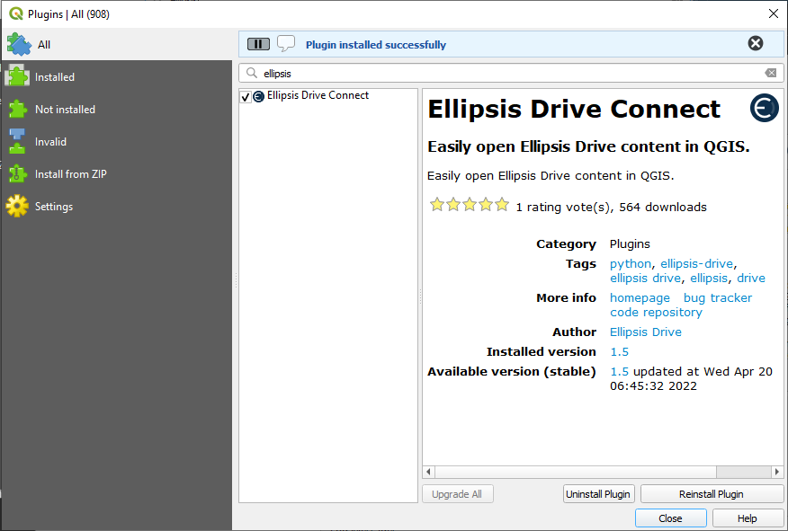

# Ellipsis Drive Connect

Ellipsis Drive Connects is a QGIS plugin, which allows you to browse your Ellipsis Drive folders and maps easily. 

# Installation instructions

First, open QGIS (version > 3.0). Then, in the menu bar, select `Plugins` and click on `Manage and Install Plugins...` as shown in the following image.

This opens the plugin manager. In the top of this window, type `ellipsis` and select the `Ellipsis Drive Connect` plugin as shown in the following image.

When `Ellipsis Drive Connect` is selected, click on `Install plugin` (indicated by the arrow in the image).

A notification should pop up, telling you that the installation was successful (see below image).

You can now close the plugin manager. The next step is to open the newly installed plugin. This is done by clicking the Ellipsis logo (as shown in the following image). 

This opens the plugin in the bottom left corner of QGIS by default. You can now log in, and view and load your content on Ellipsis Drive in QGIS.

